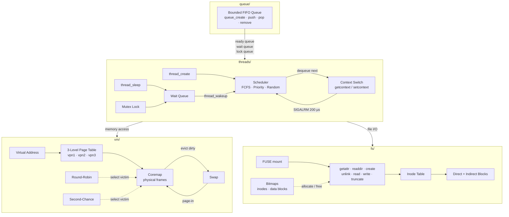
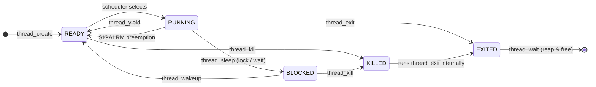
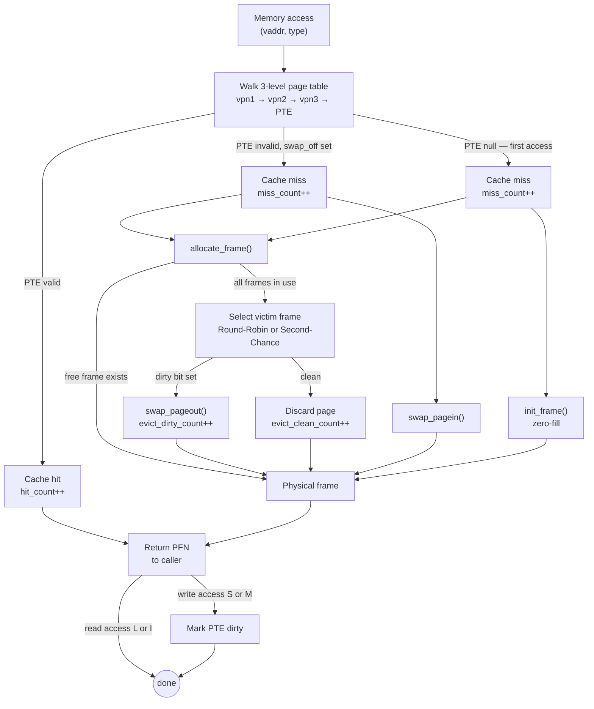

# MiniOS

A user-level operating systems kernel implemented in C, covering four fundamental OS subsystems built from scratch.

## Overview

Each module builds on the previous, forming a complete picture of core OS internals:

| Module | What it implements |
| ------ | ------------------ |
| [queue/](queue/) | Bounded intrusive FIFO queue — the shared data structure |
| [threads/](threads/) | Preemptive user-level threading library with scheduling and synchronization |
| [vm/](vm/) | Virtual memory simulator with a 3-level page table and page replacement |
| [fs/](fs/) | FUSE-based Very Simple File System (vsfs) |

---

## Modules

### Queue

A generic bounded FIFO queue that supports push, pop, peek, and O(n) removal by ID. Nodes embed queue membership directly (intrusive design), avoiding extra allocation per element.

**API:** `queue_create` · `queue_push` · `queue_pop` · `queue_top` · `queue_remove` · `queue_destroy`

---

### Threads

A full user-level threading library that runs on a single OS thread, supporting both cooperative and preemptive scheduling.

**Features:**

- Context switching via `getcontext` / `setcontext` with manually constructed stack frames
- Three pluggable schedulers: **FCFS** (round-robin under preemption), **Priority**, **Random**
- Timer-based preemption via `SIGALRM` (200 µs quantum)
- Blocking sleep / wakeup on arbitrary wait queues
- Mutex locks with wait queues (`lock_create` / `lock_acquire` / `lock_release`)
- `thread_wait` (join semantics) with per-thread wait queues

**Scheduler interface** — adding a new scheduler only requires implementing five functions (`init`, `enqueue`, `dequeue`, `remove`, `destroy`) and registering it in `schedule.h`.

---

### Virtual Memory

Simulates an OS virtual memory subsystem for tracing and benchmarking page replacement strategies.

**Features:**

- 36-bit virtual address space partitioned as 12 + 12 + 12 + 12 (3-level page table + page offset)
- Lazy page table allocation — intermediate nodes created only on first access
- Physical frame management via a coremap
- Swap-backed eviction: dirty pages written to swap, clean pages discarded
- Two replacement algorithms:
  - **Round-Robin (Clock hand)** — simple sequential eviction
  - **Second-Chance (S2Q / Clock)** — referenced bit gives pages a second chance
- Hit / miss / clean-eviction / dirty-eviction counters

---

### File System

A mountable filesystem implemented via **FUSE** (Filesystem in Userspace), backed by a disk image file.

**Layout:** superblock → inode bitmap → data block bitmap → inode table → data blocks

**Features:**

- Inode-based design (mode, size, link count, timestamps, block pointers)
- Up to `VSFS_NUM_DIRECT` direct block pointers plus one indirect block pointer
- Bitmap-based free-space management for both inodes and data blocks
- Implemented FUSE callbacks: `getattr`, `statfs`, `readdir`, `create`, `unlink`, `utimens`, `truncate`, `read`, `write`

---

## Diagrams

### System Architecture



---

### Thread Lifecycle



---

### Page Fault Flow



---

## Platform

The threading library (`threads/`) uses Linux-specific APIs: `ucontext` for context switching, x86-64 `uc_mcontext.gregs` for register setup, and `SIGALRM` for preemption. It is designed for **Linux x86-64**. The queue module builds on any POSIX system.

## Building

Each module is independently buildable.

```bash
# Bounded queue (builds test binary)
make -C queue

# Threading library (builds all tests in threads/test/)
make -C threads

# Virtual memory simulator
make -C vm

# Filesystem (requires libfuse)
make -C fs
```

Or build everything:

```bash
make
```

---

## Knowledge used 

- **C systems programming** — manual memory management, pointer arithmetic, x86-64 register manipulation
- **Data structures** — intrusive linked queues, multi-level page tables, bitmaps
- **Concurrency** — cooperative and preemptive context switching, signal masking, mutex locks, condition-variable-style wait queues
- **OS internals** — scheduling algorithms, virtual memory translation, page replacement policies, inode-based filesystem design
